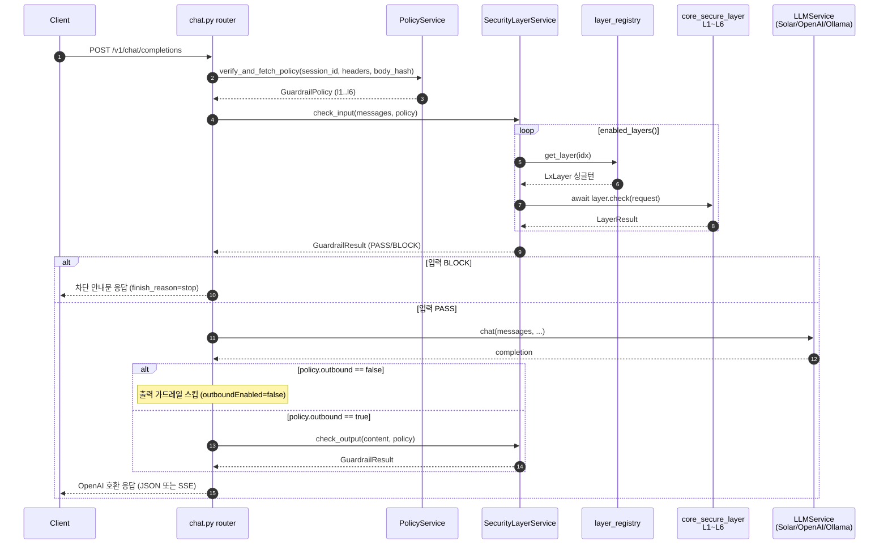

# Gateway-Backend 아키텍처 개요

## 이 문서를 읽는 방법

- **대상 독자**: Python / FastAPI 를 처음 다루는 개발자
- **다루는 범위**: `gateway-backend/` 내부 폴더·모듈 구조와, **이 프로젝트가 `../core-secure-layer/` 의 L1~L6 레이어 모델을 어떻게 호출하는지**
- **다루지 않는 범위**:
  - `core-secure-layer` 내부 구현 (본 문서는 호출 지점만 인용)
  - Request/Response 스키마 상세 필드 → [`core-info.md`](./core-info.md)
  - 아키텍처 평가·개선 권고 → [`project-analysis.md`](./project-analysis.md)
  - Solar 502 에러 복구 경로 → [`solar-api-502-remediation-plan.md`](./solar-api-502-remediation-plan.md)

### 용어 사전 (Python/FastAPI 초심자용)

| 용어 | 한 줄 설명 |
|------|-----------|
| 패키지(package) | `__init__.py` 가 들어 있는 폴더. `import app.routers.chat` 같은 점 표기로 접근한다. |
| 모듈(module) | `.py` 파일 하나. 파일 이름이 import 이름이 된다. |
| 의존성 주입(DI, Dependency Injection) | 함수가 필요한 객체를 직접 만들지 않고 "받기만" 하도록 하여 테스트·교체를 쉽게 만드는 패턴. FastAPI 에서는 `Depends(...)` 로 표현한다. |
| Pydantic 스키마 | 타입 힌트로 데이터 형태를 정의하고 자동으로 검증·직렬화해 주는 클래스(`BaseModel`). DTO 역할이다. |
| SSE(Server-Sent Events) | 서버가 `text/event-stream` 으로 청크를 밀어 보내는 단방향 스트리밍. OpenAI `stream=true` 응답이 이 포맷을 쓴다. |

---

## 1. Python 프로젝트 레이아웃 빠르게 보기

```
gateway-backend/
├── app/                    # 애플리케이션 본체 (= Python 패키지)
│   ├── __init__.py
│   ├── main.py             # FastAPI 앱 조립·엔트리 포인트
│   ├── config.py           # 환경변수 Settings
│   ├── dependencies.py     # Depends() 팩토리 모음
│   ├── errors.py           # 업스트림 오류를 구조화 JSON 으로 매핑
│   ├── routers/            # HTTP 엔드포인트 계층
│   │   └── chat.py         # /v1/chat/completions
│   ├── models/             # Pydantic DTO 계층
│   │   ├── chat.py         # OpenAI 호환 요청·응답 모델
│   │   ├── guardrail.py    # 가드레일 내부 결과 모델
│   │   └── policy.py       # admin-backend 정책 모델
│   ├── services/           # 비즈니스 로직·외부 호출 계층
│   │   ├── policy_service.py
│   │   ├── security_layer_service.py
│   │   ├── layer_registry.py         # ← core_secure_layer 싱글턴 매핑
│   │   ├── guardrail_converter.py    # ← gateway ↔ core_secure_layer 변환
│   │   ├── provider_router.py        # ← 모델명으로 provider 자동 선택
│   │   ├── request_verifier.py       # ← 사용자 4개 헤더 로컬 검증
│   │   ├── solar_service.py          # Solar 전용 얇은 래퍼
│   │   └── llm_service.py            # 범용 LLMService (전 provider 공용)
│   └── static/             # 플레이그라운드 정적 HTML/CSS
├── tests/                  # pytest 테스트 (app/ 구조를 그대로 반영)
├── docs/                   # 본 문서 및 기타 설계 문서
├── pyproject.toml          # 프로젝트·의존성·툴링 설정
└── uv.lock                 # uv 패키지 매니저 락파일
```

**기억할 점 하나**: "폴더에 `__init__.py` 가 있으면 패키지, 파일 하나면 모듈" 로 이해하면 충분하다. `app/routers/chat.py` 는 "`app` 패키지 > `routers` 서브패키지 > `chat` 모듈" 이다.

---

## 2. 실행·의존성 도구: `uv`

이 프로젝트는 `pip` 대신 [`uv`](https://docs.astral.sh/uv/) 를 사용한다. 세 가지만 기억하면 된다.

| 명령 | 용도 |
|------|------|
| `uv sync` | `pyproject.toml` 과 `uv.lock` 기준으로 가상환경에 의존성 설치 |
| `uv run pytest` | 가상환경 안에서 pytest 실행 |
| `uv run uvicorn app.main:app --reload --port 8000` | 개발 서버 기동 (코드 변경 시 자동 재시작) |

핵심은 `pyproject.toml` 에서 `core-secure-layer` 가 **editable 로컬 경로 패키지**로 등록되어 있다는 점이다. `uv sync` 하면 PyPI 가 아니라 형제 디렉터리에서 바로 설치한다.

`pyproject.toml` — `[project]` 블록

```toml
dependencies = [
    "fastapi>=0.115.0",
    "uvicorn[standard]>=0.32.0",
    "httpx>=0.27.0",
    "pydantic>=2.9.0",
    "pydantic-settings>=2.5.0",
    "python-dotenv>=1.0.0",
    "openai>=1.0.0",
    "langchain-openai>=0.3.0",
    "core-secure-layer",
]
```

`pyproject.toml` — `[tool.uv.sources]` 블록

```toml
[tool.uv.sources]
# editable 설치로 지정해, 패키지 빌드 시 wheel 에 포함되지 않는
# 모델 가중치(.safetensors 등)와 VectorDB 리소스를 source 트리에서
# 직접 참조한다. (../core-secure-layer 내부는 수정하지 않는다.)
core-secure-layer = { path = "../core-secure-layer", editable = true }
```

→ `editable = true` 이기 때문에 gateway 코드는 평범하게 `from core_secure_layer.layers.l1.l1 import L1Layer` 로 import 하면서도, core 쪽 모델 리소스(`.safetensors`, VectorDB 등) 를 source 트리에서 그대로 읽어 올 수 있다.

---

## 3. `app/` 내부 레이어링 (FastAPI 관례)

FastAPI 프로젝트에서 흔히 쓰이는 3계층 구조를 그대로 따른다.

### 3.1 앱 뼈대

| 파일 | 역할 |
|------|------|
| `app/main.py` | `FastAPI()` 인스턴스 생성, 미들웨어·라우터·예외 핸들러 조립 |
| `app/config.py` | `.env` 를 읽는 `Settings` 클래스 (pydantic-settings) |
| `app/dependencies.py` | `Depends()` 에 꽂히는 팩토리 함수 모음 |
| `app/errors.py` | 업스트림(Solar / LangChain / admin) 예외를 JSON 으로 변환 |

### 3.2 routers/ — HTTP 엔드포인트 계층

| 파일 | 엔드포인트 |
|------|-----------|
| `app/routers/chat.py` | `POST /v1/chat/completions` 단일 라우트, 5단계 가드레일 파이프라인의 오케스트레이터 |

### 3.3 models/ — Pydantic DTO 계층

| 파일 | 주요 모델 | 용도 |
|------|-----------|------|
| `app/models/chat.py` | `ChatRequest`, `ChatResponse`, `Message` | OpenAI 호환 요청·응답 |
| `app/models/guardrail.py` | `GuardrailResult`, `CheckStatus` | 가드레일 검사 결과 (내부용) |
| `app/models/policy.py` | `GuardrailPolicy` | admin-backend 활성 정책 |

### 3.4 services/ — 비즈니스 로직·외부 호출

| 파일 | 책임 |
|------|------|
| `policy_service.py` | admin-backend `POST /api/v1/gateway/verify` 위임 호출 (서명 검증 + 활성 정책 조회) |
| `request_verifier.py` | 사용자 `X-Timestamp` skew + `X-Nonce` 재연 로컬 검증 |
| `security_layer_service.py` | L1~L6 보안 검사 오케스트레이션 (핵심) |
| `layer_registry.py` | 정책 인덱스(1~6) → core_secure_layer 싱글턴 매핑 |
| `guardrail_converter.py` | gateway `Message`/`str` ↔ core `GuardrailRequest`·`LayerResult` 변환 |
| `provider_router.py` | 모델 이름으로 provider(Solar/OpenAI/Ollama) 선택 |
| `llm_service.py` | 범용 `LLMService` 클래스 — provider 세 종 모두 이 한 클래스를 인스턴스화해 사용한다 |
| `solar_service.py` | Solar 전용 얇은 래퍼 (`LLMService` 상속) |

> provider 별 어댑터(예: `openai_service.py`, `ollama_service.py`) 를 따로 두지 않는다. `provider_router.py` 의 `ProviderRouter._create_service` 가 provider 에 맞는 `api_key`/`base_url`/`model` 을 골라 `LLMService` 를 인스턴스화하고 캐싱한다.

### 3.5 의존성 방향

```
routers/ ──▶ services/ ──▶ 외부 (admin-backend, core_secure_layer, LLM providers)
              │
              └── models/ (DTO)
```

- `routers/` 는 "지휘자". HTTP 입·출력만 책임지고, 일은 services 에 넘긴다.
- `models/` 는 순수 데이터 구조. 어떤 모듈에서 import 해도 OK.
- `services/` 끼리만 서로 호출한다. `models/` → `services/` 방향 호출은 없다.

---

## 4. 엔트리 포인트 읽기 — `app/main.py`

개발 서버는 `uv run uvicorn app.main:app --reload --port 8000` 로 뜬다. uvicorn 이 `app.main` 모듈을 import 한 뒤 그 안의 `app` 변수를 ASGI 애플리케이션으로 받아 간다.

`app/main.py` — `FastAPI(...)` 초기화

```python
app = FastAPI(
    title="Agentic AI Guardrail Gateway",
    description=(
        "LangChain 기반 Multi-provider LLM Gateway. **OpenAI "
        "`/v1/chat/completions` 호환** 엔드포인트를 제공하며, ..."
    ),
    version="0.2.0",
    openapi_tags=[...],
    docs_url=None,
    lifespan=lifespan,
)
```

`app/main.py` — 라우터·정적 파일 마운트

```python
# 가드레일 채팅 라우터 마운트
app.include_router(chat.router, prefix="/v1")

# 플레이그라운드 정적 페이지 마운트 (/playground/)
app.mount(
    "/playground",
    StaticFiles(directory=_STATIC_DIR, html=True),
    name="playground",
)
```

요약:
1. `FastAPI(...)` 로 앱 인스턴스 생성 (`lifespan` 으로 httpx 클라이언트 수명주기 관리).
2. `CORSMiddleware` 전체 허용 + HTTP 로깅 미들웨어 1개 추가.
3. `include_router(chat.router, prefix="/v1")` — 이 한 줄로 `/v1/chat/completions` 가 살아난다.
4. `docs_url=None` 으로 기본 Swagger 를 끄고, `custom_swagger_docs` 핸들러가 `/docs` 에서 커스텀 상단 바 + `static/docs-overrides.css` 를 입혀 렌더한다.
5. `/playground` 정적 파일, `/health`, `/v1/models/default` 도 이 파일에서 붙는다.
6. 업스트림 예외 3종(`openai.APIError`, `httpx.HTTPError`, `langchain_core.exceptions.LangChainException`) 을 `@app.exception_handler` 로 잡아 `app/errors.py` 의 매퍼로 구조화 JSON 응답을 내려준다.

---

## 5. 핵심 질문 — 가드레일 레이어는 어떻게 호출되는가

### 5.1 연결 구조 한눈에



### 5.2 `core_secure_layer` 를 import 하는 파일은 단 두 곳

프로젝트 전체에서 `core_secure_layer` 심볼이 등장하는 gateway 쪽 파일은 다음 두 개뿐이다. 다른 모든 모듈은 이 두 파일을 통해 간접적으로 접근한다.

`app/services/layer_registry.py:6-12` — 레이어 클래스 import

```python
from core_secure_layer.layers.base import BaseLayer
from core_secure_layer.layers.l1.l1 import L1Layer
from core_secure_layer.layers.l2.l2 import L2Layer
from core_secure_layer.layers.l3.l3 import L3Layer
from core_secure_layer.layers.l4.l4 import L4Layer
from core_secure_layer.layers.l5.l5 import L5Layer
from core_secure_layer.layers.l6.l6 import L6Layer
```

`app/services/guardrail_converter.py:3` — 요청·결과 타입 import

```python
from core_secure_layer.layers.types import GuardrailRequest, LayerResult
```

→ **gateway 코드의 나머지 전부는 core_secure_layer 를 직접 건드리지 않는다.** 레이어 호출은 오직 `SecurityLayerService` 를 경유한다. 이 "단 두 지점" 원칙이 바뀌지 않는 한, core 쪽 인터페이스 변경의 영향 범위는 이 두 파일로 제한된다.

### 5.3 레이어 레지스트리 — 숫자 ↔ 레이어 객체

정책은 `l1Enabled`~`l6Enabled` 라는 불리언 여섯 개로 내려온다. 이걸 실제 레이어 객체로 바꿔 주는 "전화번호부" 가 `layer_registry.py` 다.

`app/services/layer_registry.py:14-33`

```python
_LAYER_MAP: dict[int, BaseLayer] = {
    1: L1Layer(),
    2: L2Layer(),
    3: L3Layer(),
    4: L4Layer(),
    5: L5Layer(),
    6: L6Layer(),
}


def get_layer(layer_index: int) -> BaseLayer | None:
    return _LAYER_MAP.get(layer_index)
```

포인트:
- 모듈이 import 되는 순간 `L1Layer()` ~ `L6Layer()` 가 **한 번씩만** 인스턴스화된다(파이썬에서 모듈은 최초 import 때 한 번만 실행되므로 자동 싱글턴).
- 매 요청마다 새로 만드는 비용이 없고, 내부적으로 모델 가중치 등을 한 번만 로드하면 재사용된다.
- 매핑이 없거나 `NotImplementedError` 를 던지는 레이어는 PASS 로 취급한다 (아래 5.5 참조).

### 5.4 정책 받아오기 — `PolicyService`

`app/services/policy_service.py` 의 `PolicyService.verify_and_fetch_policy` 는 admin-backend 의 `POST /api/v1/gateway/verify` 를 호출한다. 단순 정책 조회가 아니라 **서명 검증까지 ADMIN 에 위임**한 다음 활성 정책을 받아오는 단일 왕복이다.

- 요청 body: 사용자의 4개 헤더 값(`apiKey`/`timestamp`/`nonce`/`signature`) + 게이트웨이가 계산한 `bodyHash` (SHA-256 hex). 상수 `_VERIFY_PATH = "/api/v1/gateway/verify"` 로 경로가 고정돼 있다.
- 요청 헤더: 게이트웨이 자신의 `ADMIN_API_KEY` 를 `X-API-Key` 헤더로 함께 싣는다. 사용자의 `X-API-Key` 와는 별개 — 사용자 키는 body 의 `apiKey` 필드에만 들어간다.
- 응답: ADMIN 이 정책을 **바로 내려줄 수도**, 검증 메타(valid/clientName 등) 를 최상위에 둔 **envelope 로 감싸 내려줄 수도** 있다. `_extract_policy_dict` 가 최상위 `l1Enabled` 존재 / `policy`·`data`·`result`·`payload` 같은 envelope 키 / 최상위 nested dict 순으로 탐색해 정책 dict 를 추출한 뒤, `GuardrailPolicy.model_validate(...)` 로 Pydantic 모델에 바인딩한다.

`app/models/policy.py`

```python
model_config = ConfigDict(populate_by_name=True, extra="ignore")

l1: bool = Field(alias="l1Enabled")
l2: bool = Field(alias="l2Enabled")
l3: bool = Field(alias="l3Enabled")
l4: bool = Field(alias="l4Enabled")
l5: bool = Field(alias="l5Enabled")
l6: bool = Field(alias="l6Enabled")
outbound: bool = Field(default=True, alias="outboundEnabled")
```

- admin-backend 응답의 camelCase 키(`l1Enabled`) 를 alias 로 받고, 내부에서는 snake_case 짧은 이름(`l1`) 을 쓴다.
- `extra="ignore"` 덕분에 `name`, `id`, `createdAt` 같은 모르는 필드는 무시된다.
- **`outbound`** 는 출력 가드레일 파이프라인 전체 on/off 스위치다. False 면 L1~L6 활성 레이어와 무관하게 `check_output` 단계를 통째로 생략한다. ADMIN 응답에 `outboundEnabled` 키가 없으면 기본값 `True` 로 간주되어 기존 동작을 유지한다(하위 호환).

`app/models/policy.py:66-73`

```python
def enabled_layers(self) -> list[int]:
    flags = [self.l1, self.l2, self.l3, self.l4, self.l5, self.l6]
    return [idx + 1 for idx, enabled in enumerate(flags) if enabled]
```

→ `l1Enabled=True, l3Enabled=True, l5Enabled=True` 면 `[1, 3, 5]` 가 된다. 이 리스트가 `SecurityLayerService` 의 루프 변수가 된다.

### 5.5 입력 검사 — `check_input`

`app/services/security_layer_service.py` 의 `SecurityLayerService.check_input`:

```python
async def check_input(
    self,
    messages: list[Message],
    policy: GuardrailPolicy,
) -> GuardrailResult:
    enabled = policy.enabled_layers()
    ...
    for layer_idx in enabled:
        result = await self._run_layer_input(layer_idx, messages)
        if result.status is CheckStatus.BLOCK:
            return result
    return GuardrailResult(status=CheckStatus.PASS)
```

루프는 **첫 BLOCK 에서 즉시 중단**한다 (short-circuit). 이후 레이어는 실행하지 않는다.

실제 호출 지점은 같은 파일의 private 헬퍼 `_run_layer_input` 이며, 네 단계로 요약된다:

1. `get_layer(idx)` 로 core_secure_layer 싱글턴을 받아 온다. 매핑이 없으면 결과에 `layer="L{idx}"` 를 찍은 채 PASS.
2. `messages_to_request(messages)` 로 `Message[]` → `GuardrailRequest` 변환 (user 메시지 본문만 `\n\n` 으로 연결, `app/services/guardrail_converter.py` 참조).
3. `await layer.check(request)` — **여기가 core_secure_layer 를 실제로 호출하는 유일한 라인**이다. 레이어가 `NotImplementedError` 를 던지면 PASS 로 처리하면서 `layer=layer.name` 을 스탬프.
4. `LayerResult` 를 `layer_result_to_guardrail_result` 로 gateway 내부 모델로 역변환한 뒤 `_with_layer_name` 으로 레이어 이름을 보강.

모든 경로에서 `_log_layer_result` 가 `layer`/`status`/`reason`/`severity`/`confidence`/`tags` 를 한 줄 구조화 로그로 남긴다. BLOCK 은 `warning`, 그 외는 `info` 레벨.

### 5.6 LLM 호출

입력 검사를 통과하면 `provider_router.resolve(request.model)` 이 모델 이름을 보고 알맞은 `LLMService` 를 골라 준다.

`app/routers/chat.py` — LLM 호출 지점

```python
llm_service, resolved_model = provider_router.resolve(request.model)
passthrough["model"] = resolved_model
completion = await llm_service.chat(messages=api_messages, **passthrough)
```

- provider 는 세 가지: **Solar** (기본), **OpenAI** (`gpt-*`, `o1-*`, `o3-*`, `ft:gpt-*`, `chatgpt-*` 자동 감지), **Ollama** (`ollama/...` 접두사로 명시).
- `LLMService` 는 LangChain `ChatOpenAI` 를 감싼 단일 클래스다. `ProviderRouter._create_service` 가 provider 마다 다른 `api_key`/`base_url`/`model` 을 주입해 인스턴스를 만든 뒤 `get_service` 에서 캐싱한다. `solar_service.py` 의 `SolarService` 만 Solar 전용 얇은 상속 래퍼로 유지된다.

### 5.7 출력 검사 — `check_output`

`SecurityLayerService.check_output` 은 `check_input` 과 거의 같은 구조로, 입력이 `messages` 대신 `content: str` 이다. 내부 헬퍼 `_run_layer_output` 역시 같은 `get_layer(idx)` 를 써서 **동일한 레이어 싱글턴을 재사용**한다. 입력·출력은 레이어 입장에서 단지 다른 `GuardrailRequest` 일 뿐이다.

> **관찰 모드 전용 대응 메서드**: `check_input_all` / `check_output_all` 은 같은 내부 헬퍼(`_run_layer_input`/`_run_layer_output`) 를 재사용해 BLOCK 이 나와도 루프를 끊지 않고 **활성 레이어 개수만큼의 결과 리스트**를 반환한다. 각 결과는 `_with_layer_name` 으로 `layer="L{idx}"` 가 보강돼 정책 순서 그대로 클라이언트 응답의 `guardrail_reports` 에 실린다. `CONTINUE_ON_LAYER_FAILURE=true` 인 관찰 모드 경로에서만 호출된다.

### 5.8 차단되면 어떻게 응답하는가 (정상 LLM 응답 shape + 차단 안내문)

가드레일이 BLOCK 을 내면 HTTP 상태코드는 **200** 이다. 클라이언트 입장에서는 정상 LLM 응답과 동일한 shape (`finish_reason="stop"`, 비표준 `error` 필드 없음) 을 받는다. 차단 사실은 `choices[0].message.content` 에 **몇 번째 레이어에서 어떤 사유로 차단됐는지** 한글 안내문으로 담겨 노출된다.

응답을 빌드하는 두 함수 — 모두 `app/routers/chat.py` 안에 있다:

| 함수 | 역할 |
|------|------|
| `_build_block_content` | "요청이 가드레일 L*x*(입력/출력 보안) 단계에서 차단되었습니다\n사유: *reason*\n다른 표현으로 다시 시도해 주세요." 형태의 다라인 문자열 조립. 스트리밍·비스트리밍 공용. |
| `_build_block_response` | 비스트리밍 `ChatResponse` 객체 조립. `message.content` 에 위 안내문을 담고 `finish_reason="stop"`, `usage=None`. |

스트리밍 차단은 별도 헬퍼 없이 정상 응답용 `_stream_openai_chunks` 를 재사용한다. `chunk_size=1`(문자 단위), `inter_chunk_delay=GUARDRAIL_BLOCK_STREAM_DELAY_SECONDS`(기본 20ms) 를 주어 실제 LLM 토큰 스트림처럼 프레임이 흘러나오게 한다.

**입력 BLOCK 분기** (`chat_completions` 내부):

```python
if input_result.status == CheckStatus.BLOCK:
    ...
    if request.stream:
        block_content = _build_block_content(
            "input", input_result.layer, input_result.reason
        )
        return StreamingResponse(
            _stream_openai_chunks(
                block_content,
                chunk_id=..., created=..., model=...,
                finish_reason="stop",
                chunk_size=_BLOCK_STREAM_CHUNK_SIZE,
                inter_chunk_delay=GUARDRAIL_BLOCK_STREAM_DELAY_SECONDS,
            ),
            media_type="text/event-stream",
            headers=_SSE_HEADERS,
        )
    return _build_block_response(input_result, stage="input", ...)
```

**출력 BLOCK 분기** — LLM 호출이 끝난 뒤의 동일한 갈림길:

- 스트리밍 요청이면 `_build_block_content("output", ...)` → `_stream_openai_chunks(...)` 로 정상 스트림과 동일한 3-part SSE 시퀀스를 방출.
- 비스트리밍이면 `_build_block_response(..., stage="output", ...)` 로 JSON 하나.
- 두 경로 모두 원본 LLM 응답 텍스트는 유출하지 않는다. `content` 필드는 `_build_block_content()` 가 생성한 안내문으로 교체된다.

비스트리밍 BLOCK `ChatResponse` 뼈대 (`_build_block_response`):

```python
return ChatResponse(
    id=chunk_id,
    object="chat.completion",
    created=created,
    model=model,
    choices=[
        ChatResponseChoice(
            index=0,
            message=ChatResponseMessage(
                role="assistant",
                content=_build_block_content(stage, result.layer, result.reason),
            ),
            finish_reason="stop",
        )
    ],
    usage=None,
)
```

관찰 모드(`CONTINUE_ON_LAYER_FAILURE=true`) 경로는 `_run_observe_mode_pipeline` 이 별도로 타며, 차단 안내문 재작성 대신 `_build_guardrail_reports` 로 `{mode: "observe", input: [...], output: [...]}` 를 응답 본문에 끼워 넣고 원본 LLM 응답을 그대로 전달한다.

---

## 6. 의존성 주입 흐름 (`Depends`)

`chat_completions` 핸들러는 `PolicyService`, `SecurityLayerService`, `ProviderRouter`, `Settings` 4개 의존성을 받는다. 그것들이 어떻게 조립되는지 한 눈에 보자.

`app/dependencies.py` — 팩토리 발췌

```python
def get_policy_service(
    settings: Annotated[Settings, Depends(get_settings)],
    http_client: Annotated[httpx.AsyncClient, Depends(get_http_client)],
) -> PolicyService:
    return PolicyService(
        admin_backend_url=settings.admin_backend_url,
        http_client=http_client,
        admin_api_key=(
            settings.admin_api_key.get_secret_value()
            if settings.admin_api_key is not None
            else None
        ),
    )


def get_security_service() -> SecurityLayerService:
    return SecurityLayerService()
```

`app/routers/chat.py` — 라우터 시그니처 (`chat_completions`)

```python
@router.post("/chat/completions", response_model=None)
async def chat_completions(
    request: ChatRequest,
    policy_service: Annotated[PolicyService, Depends(get_policy_service)],
    security_service: Annotated[
        SecurityLayerService, Depends(get_security_service)
    ],
    provider_router: Annotated[ProviderRouter, Depends(get_provider_router)],
    settings: Annotated[Settings, Depends(get_settings)],
) -> ChatResponse | StreamingResponse:
```

**초심자용 비유**: 핸들러 함수의 인자에 `Annotated[타입, Depends(팩토리)]` 라고 써 두면, FastAPI 가 요청이 들어올 때마다 팩토리 함수를 "자동으로" 호출해서 결과를 그 자리에 꽂아 준다. 핸들러는 누가 어떻게 만들었는지 신경 쓰지 않고 받은 객체를 그냥 쓴다.

이 구조가 주는 실질적 이득:
- 단위 테스트에서 `app.dependency_overrides[get_security_service] = lambda: fake_service` 한 줄로 의존성을 갈아끼울 수 있다.
- `httpx.AsyncClient` 와 `ProviderRouter` 는 싱글턴(`@lru_cache` / 모듈 전역)으로 관리되어, 라우터는 깨끗한 인터페이스만 본다.

---

## 7. 테스트가 어떻게 조직되어 있는가

`tests/` 는 `app/` 의 폴더 구조를 거울처럼 따른다. 이 덕분에 "어느 파일을 고쳤는가" 만 알아도 어느 테스트 파일을 먼저 돌려야 할지 바로 찾을 수 있다.

| 애플리케이션 파일 | 대응 테스트 |
|------------------|------------|
| `app/routers/chat.py` | `tests/unit/routers/test_chat_router.py` (+ stream/error 전용 테스트) |
| `app/services/policy_service.py` | `tests/unit/services/test_policy_service.py` |
| `app/services/security_layer_service.py` | `tests/unit/services/test_security_layer_service.py` |
| `app/services/layer_registry.py` | `tests/unit/services/test_layer_registry.py` |
| `app/services/guardrail_converter.py` | `tests/unit/services/test_guardrail_converter.py` |
| `app/services/provider_router.py` | `tests/unit/services/test_provider_router.py` |
| `app/models/policy.py` | `tests/unit/models/test_policy.py` |

전체 실행과 단일 파일 실행:

```bash
uv run pytest                                                   # 전체
uv run pytest tests/unit/services/test_security_layer_service.py -v   # 단일 파일
uv run pytest -k "blocked"                                      # 키워드 매칭
```

---

## 8. 더 깊이 들어가려면

| 알고 싶은 것 | 찾아갈 곳 |
|--------------|-----------|
| Request/Response 필드 상세, OpenAI 호환성 | [`docs/core-info.md`](./core-info.md) |
| 헤더 4종 검증 + ADMIN 위임 스펙 상세 | [`docs/feature-validation.md`](./feature-validation.md) |
| 아키텍처 평가, 개선 권고, 기술부채 | [`docs/project-analysis.md`](./project-analysis.md) |
| Solar 업스트림 502 오류 복구 전략 | [`docs/solar-api-502-remediation-plan.md`](./solar-api-502-remediation-plan.md) |
| 프로젝트 전체 개요·실행 방법 | [`README.md`](../README.md) |
| 개발 워크플로(커밋·TDD·툴링) | [`CLAUDE.md`](../CLAUDE.md) |

**core_secure_layer 쪽을 들여다봐야 할 때의 원칙**: 이 문서는 gateway 내부만 다룬다. 레이어 내부 구현이 궁금하다면 `../core-secure-layer/` 의 `layers/lN/` 아래를 보되, 수정은 피하고 **gateway 쪽에서 import 하는 인터페이스**(`BaseLayer.check(GuardrailRequest) -> LayerResult`) 만 바뀌지 않는다면 본 문서의 호출 흐름 설명은 그대로 유효하다.
